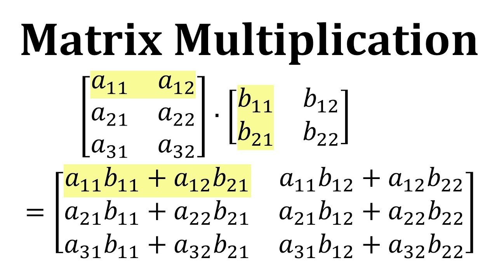

# **Matrices (Why Everything Is Batch-Based)**
### **Matrix = List of Vectors**
```
[
  [1, 2, 3], <-- a vector (i, 2j, 3k)
  [4, 5, 6] <-- a vector (4i, 5j, 3k)
]
```
in ML:
- Rows = data points
- Columns = features

----

### Matrix x Vector
This is how models process **many features at once.**

### **Code Task (Important)**

Write **matrix-vector multiplication** <br />
[My Implementation Here](../matrixVectorMul.py)

----

### **Why ML Uses Matrices**
Because: 
- GPUs love parallel math (faster)
- Batches are faster then multiple loops
- Neural networks = stacked matrix multiplications

----
## **Matrix x Matrix (The Engine)**

### **This is the backone of deep learning.**
### **Code Task (Mandatory)**
write matrix multiplication from scratch

**Notes:**
- Requirements are: Number of columns in Matrix 1 has to be equal to Number of rows in Matrix 2

- End Result: A NumRows x NumCols matrix should be the output

[Implementation Here](../matrixMul.py)
Though this, can have many optimizations to make it better.

### **Insight**
This is why **NumPy** exists.

